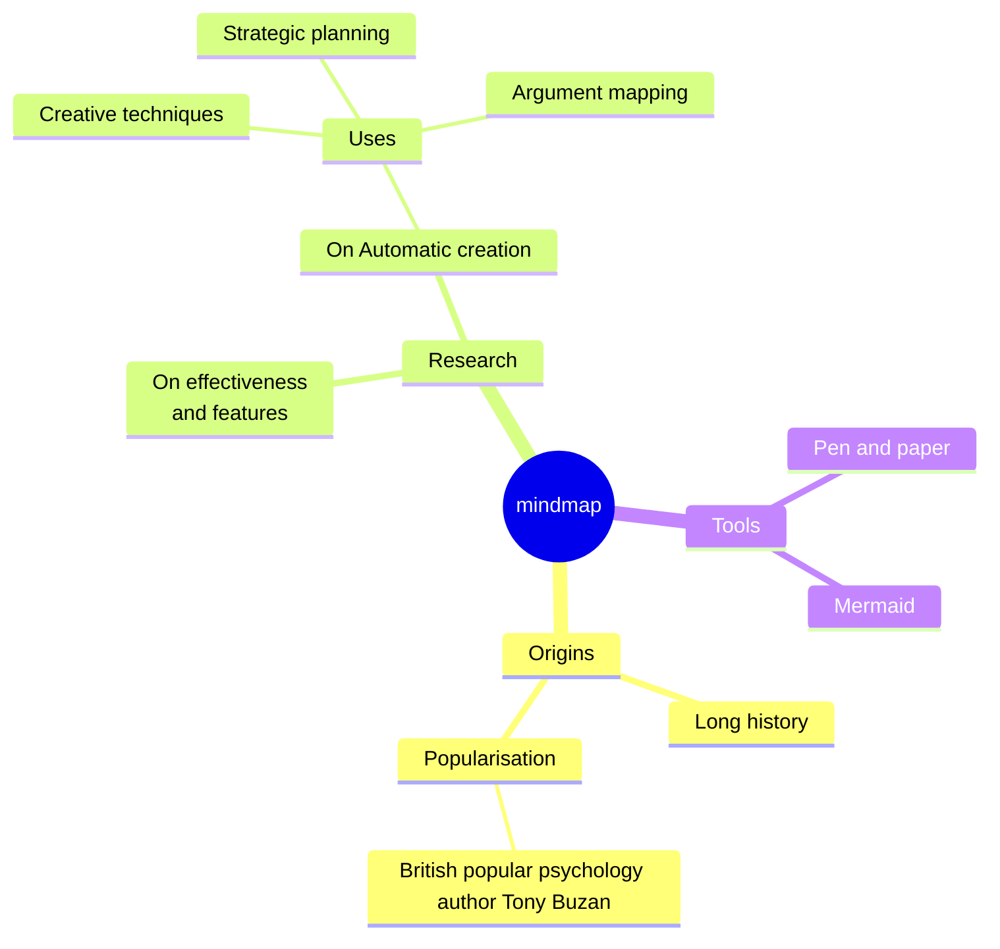

# Hello I am Julien Delsescaux

<!--<PRESENTATION>-->
## 🧑‍💻 Software Developer & Architect | 20+ Years of Experience | Pragmatic & Creative

Welcome to my GitHub! I've been developing and optimizing high-impact web applications for over 20 years. My approach is pragmatic, focused on efficiency and user experience.

<!--</PRESENTATION>-->

<!--<WORKING-ON> -->
## 🛠️ What I'm working on:

- Web Development: PHP (Laravel, Symfony), TypeScript (React, Next.js)
- Cloud & DevOps: Docker, Kubernetes (K3s)
- AI : RAG, Langflow
- Automation: GitHub Actions,  Bash scripts, N8N
- No/low code: Directus

<!--</WORKING-ON> -->

<!--<DEMOS>-->
## 📌 Demos

### [Game of life in a React old fashion way](https://github.com/deljdlx/dc-gameoflife)

👓 Demo: [https://gameoflife.jlb.ninja/](https://gameoflife.jlb.ninja/)

<!--</DEMOS>-->

<!--<MISC>-->
<!--</MISC>-->

<!--

//-->

<!--
Here are some ideas to get you started:

- 🔭 I’m currently working on ...
- 🌱 I’m currently learning ...
- 👯 I’m looking to collaborate on ...
- 🤔 I’m looking for help with ...
- 💬 Ask me about ...
- 📫 How to reach me: ...
- 😄 Pronouns: ...
- ⚡ Fun fact: ...
-->
