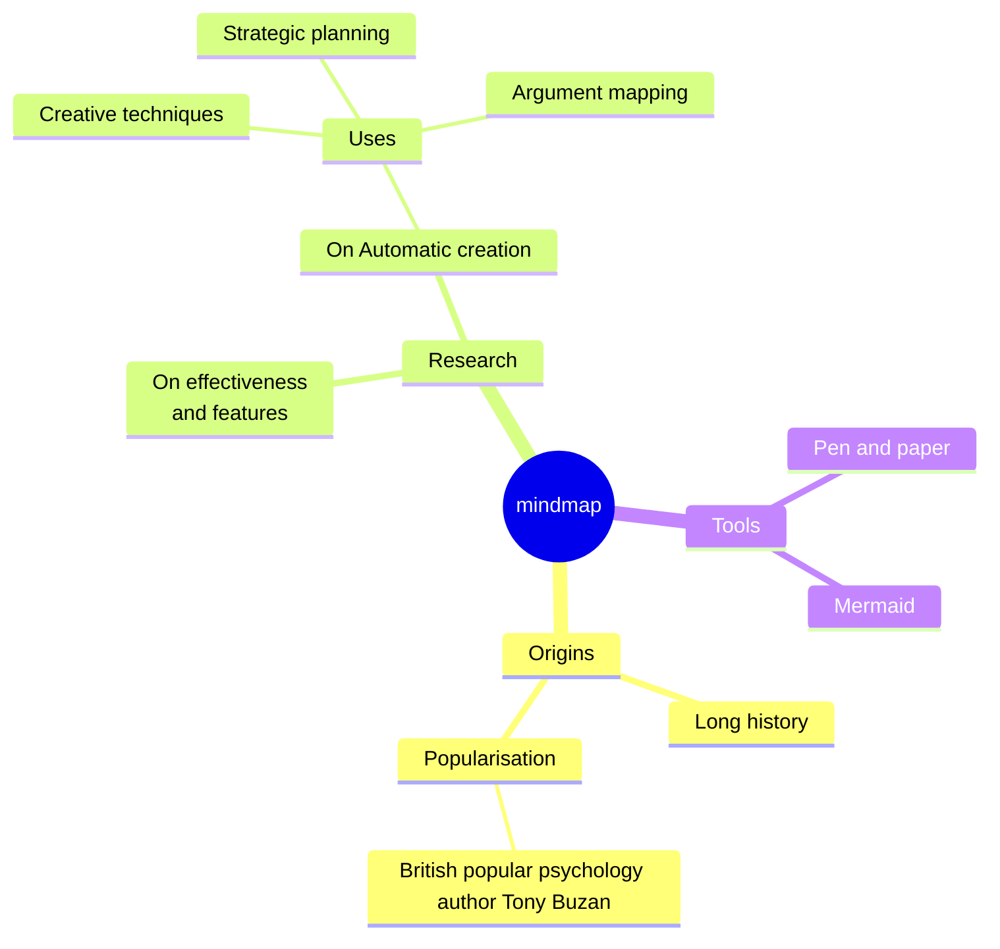

# Hello I am Julien Delsescaux

<!--<PRESENTATION>-->

## 🧑‍💻 Software Developer & Architect | 20+ Years of Experience | Pragmatic & Creative

Welcome to my GitHub! I've been developing and optimizing high-impact web applications for over 20 years. My approach is pragmatic, focused on efficiency and user experience.

<!--</PRESENTATION>-->

<!--<RESUME> -->
## 👨‍💻 Professional highlights

### 🚀 Pecule.co - Architect
Co-founder of Pecule.co, a startup providing real estate companies with a platform to tokenize real estate assets. I am responsible for the architecture and development of the platform.

### 🚀 Capital.fr – Lead Developer
Led the full-stack development and optimization of Capital.fr, a major French financial news website.

- Improved performance, scalability, and backend architecture
- Optimized database load and SEO to enhance search rankings and page speed

### 🚀 RueDuCommerce.com – Software Engineer

Developed and optimized product pages for a leading French e-commerce platform.

Focused on SEO optimization and cache invalidation management for product pages

### 🚀 Marie Claire Group – Architect

Led the development of a new CMS for the Marie Claire Group, a leading French media company.

- Migrated 7+ websites to the new CMS
- Optimized backend architecture and improved the editorial workflow

### 🚀 Freelance & Consulting

Worked on multiple projects involving miscellaneous technologies and industries.
Specialized in API development, automation, refactoring, and performance optimization.

<!--</RESUME> -->

<!--<WORKING-ON> -->
## 🛠️ What I'm working on:

- Web Development: PHP (Laravel, Symfony), TypeScript (React, Next.js)
- Cloud & DevOps: Docker, Kubernetes (K3s)
- AI : RAG, Langflow
- Automation: GitHub Actions,  Bash scripts, N8N
- No/low code: Directus

<!--</WORKING-ON> -->

<!--<DEMOS>-->

## 📌 Demos
<!--<DEMO-deljdlx/dc-match3>-->

### [🕹️ Small Match-3 Game  ](https://github.com/deljdlx/dc-match3)

A simple **Match-3 game** built with **React**.  
Currently using **Context API**, but should be refactored to **Zustand** for better state management.

👓 Demo: [https://match3.jlb.ninja/](https://match3.jlb.ninja/)

<!--</DEMO-deljdlx/dc-match3>-->

<!--<DEMO-deljdlx/dc-gameoflife>-->

### [🍄 Game of life in a React old fashion way](https://github.com/deljdlx/dc-gameoflife)

A [Conway game of life implemention](https://en.wikipedia.org/wiki/Conway%27s_Game_of_Life) implementation written in **(very) old-school React**, straight from the **prehistoric era of front-end development** (circa 2013).  

🦖 Featuring:
- `React.createElement(...)` – because hooks weren’t even a thing back then!  
- Inline styles like it’s **CSS apocalypse**  
- `dangerouslySetInnerHTML` – living on the edge!

👓 Demo: [https://gameoflife.jlb.ninja/](https://gameoflife.jlb.ninja/)

<!--</DEMO-deljdlx/dc-gameoflife>-->

<!--<DEMO-deljdlx/dc-displayblock>-->

### [🧊 Display block](https://github.com/deljdlx/dc-displayblock)

🚀 A **3D "voxel" rendering engine**, built **entirely from scratch** using **only JavaScript, CSS, and HTML**.  

It’s **a voxel engine that refuses to acknowledge that it shouldn't exist** 😆.

👓 Demo: [https://displayblock.jlb.ninja/](https://displayblock.jlb.ninja/)

<!--</DEMO-deljdlx/dc-displayblock>-->

<!--</DEMOS>-->

<!--<MISC>-->

<!--</MISC>-->

<!--

//-->

<!--
Here are some ideas to get you started:

- 🔭 I’m currently working on ...
- 🌱 I’m currently learning ...
- 👯 I’m looking to collaborate on ...
- 🤔 I’m looking for help with ...
- 💬 Ask me about ...
- 📫 How to reach me: ...
- 😄 Pronouns: ...
- ⚡ Fun fact: ...
-->
