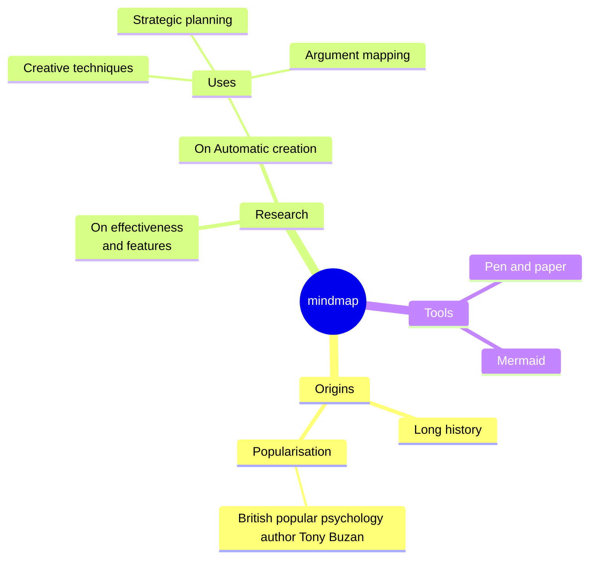

# Hello I am Julien Delsescaux

<!--<PRESENTATION>-->

## 🧑‍💻 Software Developer & Architect | 20+ Years of Experience | Pragmatic & Creative

👋 Welcome! I'm a **software architect, full-stack developer & DevOps enthusiast** with **20+ years of experience**.
I love **building scalable systems, optimizing workflows, and creating experimental projects** that push the limits of what's possible in web development.

<!--</PRESENTATION>-->

<!--<WORKING-ON> -->
<!--</WORKING-ON> -->

<!--<DEMOS>-->

## 🖼️ Technical showcase
<!--<DEMO-deljdlx/dc-match3>-->

### [🕹️ Small Match-3 Game  ](https://github.com/deljdlx/dc-match3)

A simple **Match-3 game** built with **React**.  
Currently using **Context API**, but should be refactored to **Zustand** for better state management.

👓 Demo: [https://match3.jlb.ninja/](https://match3.jlb.ninja/)

<!--</DEMO-deljdlx/dc-match3>-->

<!--<DEMO-deljdlx/dc-gameoflife>-->

### [🍄 Game of life in a React old fashion way](https://github.com/deljdlx/dc-gameoflife)

A [Conway game of life implemention](https://en.wikipedia.org/wiki/Conway%27s_Game_of_Life) implementation written in **(very) old-school React**, straight from the **prehistoric era of front-end development** (circa 2013).

Some updates were made to improve UI and UX, but the core code is still **pure React** from the **dawn of time**.

🦖 Featuring:
- `React.createElement(...)` – because hooks weren’t even a thing back then!  
- Inline styles like it’s **CSS apocalypse**  
- `dangerouslySetInnerHTML` – living on the edge!

👓 Demo: [https://gameoflife.jlb.ninja/](https://gameoflife.jlb.ninja/)

<!--</DEMO-deljdlx/dc-gameoflife>-->

<!--<DEMO-deljdlx/dc-displayblock>-->

### [🧊 Display block](https://github.com/deljdlx/dc-displayblock)

🚀 A **3D "voxel" rendering engine**, built **entirely from scratch** using **only JavaScript, CSS, and HTML**.  

It’s **a voxel engine that refuses to acknowledge that it shouldn't exist** 😆.

👓 Demo: [https://displayblock.deljdlx.fr/](https://displayblock.deljdlx.fr/)

<!--</DEMO-deljdlx/dc-displayblock>-->

<!--<DEMO-deljdlx/dc-webdrop>-->

### [🛜 Webdrop – Airdrop, but for the Web](https://github.com/deljdlx/dc-webdrop)

Open the URL, share it, drag & drop a file onto an user avatar. **That’s it.** 🚀
A simple and instant way to transfer files, directly in your browser.

No apps. No setup. Just **pure JavaScript + WebSockets + PHP (Ratchet).**

👓 Demo: [https://webdrop.jlb.ninja/](https://webdrop.jlb.ninja/)

<!--</DEMO-deljdlx/dc-webdrop>-->

<!--<DEMO-deljdlx/dc-decision-tree>-->

### [🌳 Decision Tree Builder](https://github.com/deljdlx/dc-decision-tree)

Build, Simulate & Export Dynamic Decision Trees

A **Proof of Concept** for an **interactive decision tree editor** with **real-time simulation** and **JSON export**.

👓 Demo: [https://decision-tree.jlb.ninja/](https://decision-tree.jlb.ninja/)

<!--</DEMO-deljdlx/dc-decision-tree>-->

<!--<DEMO-deljdlx/dc-rpg-engine>-->

### [🎮 RPG Engine](https://github.com/deljdlx/dc-rpg-engine)

A Modest Yet Overengineered RPG Engine

A browser-based RPG engine, built with **pure JavaScript, CSS & HTML**.  
No WebGL, no Canvas, just DOM magic.

👓 Demo: [https://rpg-engine.jlb.ninja/](https://rpg-engine.jlb.ninja/)

<!--</DEMO-deljdlx/dc-rpg-engine>-->

<!--<DEMO-deljdlx/dc-container-kingdom>-->

### [🎮 Container kingdom](https://github.com/deljdlx/dc-container-kingdom)

Container Kingdom is an interactive visualization tool for Docker containers, using an RPG engine to graphically represent networks and services.

👓 Demo: [https://container-kingdom.jlb.ninja/](https://container-kingdom.jlb.ninja/)

<!--</DEMO-deljdlx/dc-container-kingdom>-->

<!--<DEMO-deljdlx/dc-paris-toilets>-->

### [🚻 Paris public toilets](https://github.com/deljdlx/dc-paris-toilets)

A microsite to help Parisians and tourists find public toilets in Paris.

👓 Demo: [https://paris-toilets.deljdlx.fr/](https://paris-toilets.deljdlx.fr/)

<!--</DEMO-deljdlx/dc-paris-toilets>-->

<!--</DEMOS>-->

<!--<RESUME> -->
## 👨‍💻 Professional highlights

### 🚀 Pecule.co - Architect
Co-founder of Pecule.co, a startup providing real estate companies with a platform to tokenize real estate assets. I am responsible for the architecture and development of the platform.

### 🚀 Capital.fr – Lead Developer
Led the full-stack development and optimization of Capital.fr, a major French financial news website.

- Improved performance, scalability, and backend architecture
- Optimized database load and SEO to enhance search rankings and page speed

### 🚀 RueDuCommerce.com – Software Engineer

Developed and optimized product pages for a leading French e-commerce platform.

Focused on SEO optimization and cache invalidation management for product pages

### 🚀 Marie Claire Group – Architect

Led the development of a new CMS for the Marie Claire Group, a leading French media company.

- Migrated 7+ websites to the new CMS
- Optimized backend architecture and improved the editorial workflow

### 🚀 Freelance & Consulting

Worked on multiple projects involving miscellaneous technologies and industries.
Specialized in API development, automation, refactoring, and performance optimization.

<!--</RESUME> -->

<!--<MISC>-->

<!--</MISC>-->

<!--

```mermaid
mindmap
  root((mindmap))
    Origins
      Long history
      ::icon(fa fa-book)
      Popularisation
        British popular psychology author Tony Buzan
    Research
      On effectiveness<br/>and features
      On Automatic creation
        Uses
            Creative techniques
            Strategic planning
            Argument mapping
    Tools
      Pen and paper
      Mermaid
```
//-->

<!--
Here are some ideas to get you started:

- 🔭 I’m currently working on ...
- 🌱 I’m currently learning ...
- 👯 I’m looking to collaborate on ...
- 🤔 I’m looking for help with ...
- 💬 Ask me about ...
- 📫 How to reach me: ...
- 😄 Pronouns: ...
- ⚡ Fun fact: ...
-->

<!--
test update
-->